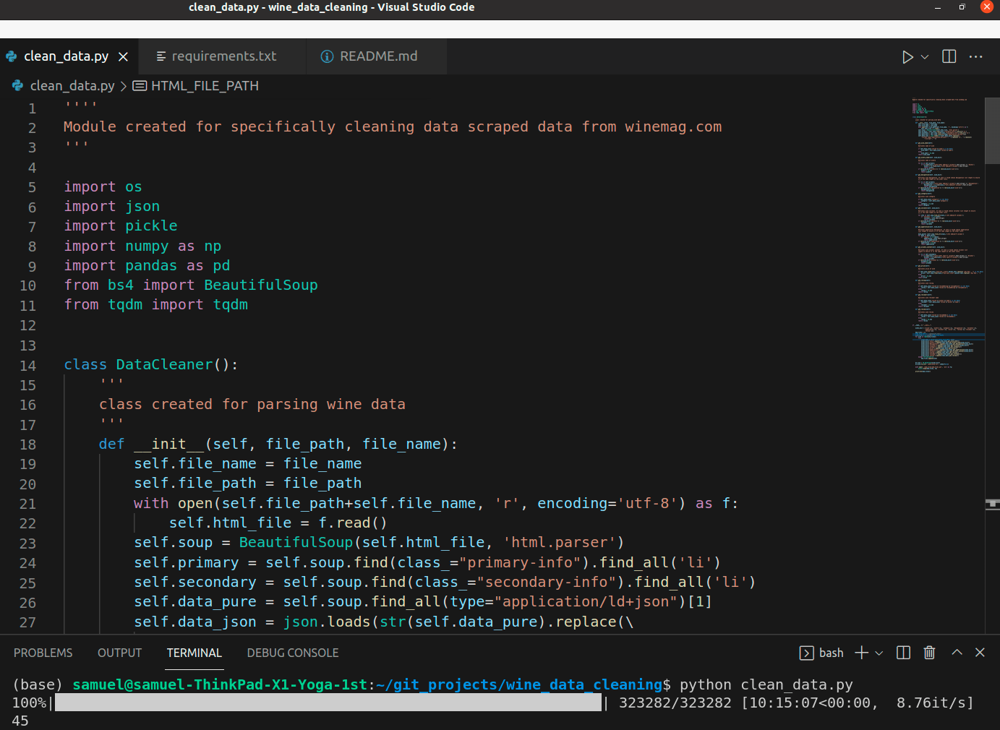

<div id="top"></div>

<h3 align="center">Wine Data Cleaning</h3>

<br />
<div align="center">
  <a href="https://github.com/SamuelAdamsMcGuire/wine_data_clean">
    
  </a>


  <p align="center">
    <br />
    <a href="https://github.com/SamuelAdamsMcGuire/wine_data_clean"><strong>Explore the docs »</strong></a>
    <br />
    <br />
    <a href="https://github.com/SamuelAdamsMcGuire/wine_data_clean">View Demo</a>
    ·
    <a href="https://github.com/SamuelAdamsMcGuire/wine_data_clean/issues">Report Bug</a>
    ·
    <a href="https://github.com/SamuelAdamsMcGuire/wine_data_clean/issues">Request Feature</a>
  </p>
</div>


<!-- TABLE OF CONTENTS -->
<details>
  <summary>Table of Contents</summary>
  <ol>
    <li>
      <a href="#about-the-project">About The Project</a>
      <ul>
        <li><a href="#built-with">Built With</a></li>
      </ul>
    </li>
    <li>
      <a href="#getting-started">Getting Started</a>
      <ul>
        <li><a href="#prerequisites">Prerequisites</a></li>
        <li><a href="#installation">Installation</a></li>
      </ul>
    </li>
    <li><a href="#usage">Usage</a></li>
    <li><a href="#roadmap">Roadmap</a></li>
    <li><a href="#contributing">Contributing</a></li>
    <li><a href="#license">License</a></li>
    <li><a href="#contact">Contact</a></li>
  </ol>
</details>


<!-- ABOUT THE PROJECT -->
## About The Project

The goal was to parse over 320k wine review pages into a clean pandas dataframe. The pages were downloaded locally from a google bucket using the following command:
```
gsutil -m cp -r gs://name-of-bucket
```

Once the data was stored locally I developed a module to parse the pages for the data found relevant for use in a ML prediction model that will make wine recommendation base on the users taste.  

The next step is to preform some NLP preprocessing and train a model. The final goal is to deploy the model as a web application.

<p align="right">(<a href="#top">back to top</a>)</p>


### Built With

* [Python](https://www.python.org/)
* [beatiful soup](https://www.crummy.com/software/BeautifulSoup/bs4/doc/)
* [pandas](https://pandas.pydata.org/)
* [numpy](https://numpy.org)
* [tqdm](https://tqdm.github.io/)

<p align="right">(<a href="#top">back to top</a>)</p>


<!-- GETTING STARTED -->
## Getting Started

To properly get started see [samssimplescraper](https://github.com/SamuelAdamsMcGuire/simplescraper) and [wine data collection](https://github.com/SamuelAdamsMcGuire/wine_data_collection) for instructions on how to scrape the entire dataset. 

Otherwise clone this repository and us the example `html` file in this to experiment with. 

### Prerequisites

- See requirements for need python libraries

### Installation

Clone repository
  ```shell
  git clone git@github.com:SamuelAdamsMcGuire/wine_data_clean.git
  ```

Install requirements_
```shell
pip install -r /path/to/requirements.txt
``` 

                
<p align="right">(<a href="#top">back to top</a>)</p>


<!-- USAGE EXAMPLES -->
## Usage

Code can be used as is for learning purposes. Or it can be adapted to user's goal. Follow the **Roadmap** and feel free to get in touch with any and all questions or comments. 

<p align="right">(<a href="#top">back to top</a>)</p>


<!-- ROADMAP -->
## Roadmap

1. Clone this repository.

2. Adjust script for the one example file (feel free to ask for my assistance). Or use on a larger dataset that is scraped using the aforementioned tools.


See the [open issues](https://github.com/SamuelAdamsMcGuire/wine_data_clean/issues) for a full list of proposed features (and known issues).

<p align="right">(<a href="#top">back to top</a>)</p>

<!-- CONTRIBUTING -->
## Contributing

Contributions are what make the open source community such an amazing place to learn, inspire, and create. Any contributions you make are **greatly appreciated**.

If you have a suggestion that would make this better, please fork the repo and create a pull request. You can also simply open an issue with the tag "enhancement".
Don't forget to give the project a star! Thanks again!

1. Fork the Project
2. Create your Feature Branch (`git checkout -b feature/AmazingFeature`)
3. Commit your Changes (`git commit -m 'Add some AmazingFeature'`)
4. Push to the Branch (`git push origin feature/AmazingFeature`)
5. Open a Pull Request

<p align="right">(<a href="#top">back to top</a>)</p>


<!-- LICENSE -->
## License

Distributed under the MIT License. See `LICENSE` for more information.

<p align="right">(<a href="#top">back to top</a>)</p>


<!-- CONTACT -->
## Contact

Samuel Adams McGuire - samuelmcguire@engineer.com

Linkedin: [LinkedIn](https://www.linkedin.com/in/samuel-mcguire/)

Project Link: [https://github.com/SamuelAdamsMcGuire/wine_data_clean](https://github.com/SamuelAdamsMcGuire/wine_data_clean)

<p align="right">(<a href="#top">back to top</a>)</p>
